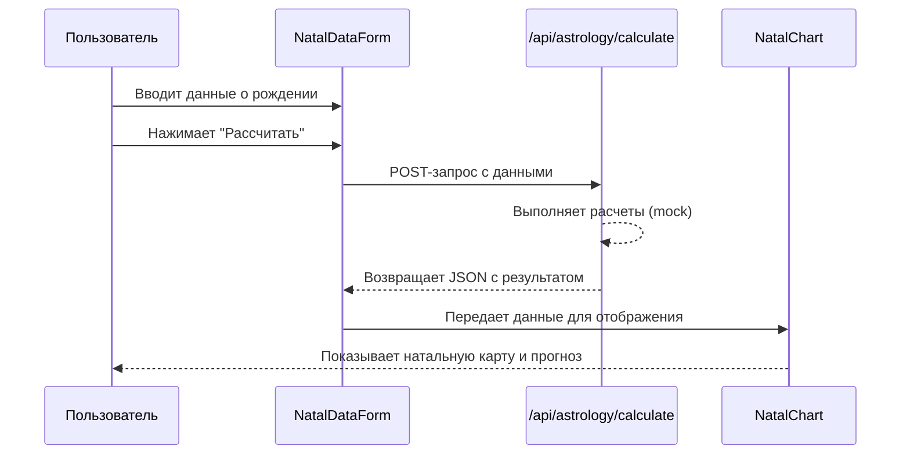

# Архитектура: AI Astro Tarot

## Обзор

Проект построен на базе фреймворка **Next.js** с использованием **App Router**, что определяет его архитектуру как гибридное приложение, сочетающее рендеринг на стороне сервера (SSR) и генерацию статических страниц (SSG) с клиентской интерактивностью (CSR).

## Структура директорий

-   `src/app/`: Основная директория проекта.
    -   `page.tsx`: Главная (лендинг) страница приложения.
    -   `layout.tsx`: Корневой макет, оборачивающий все страницы.
    -   `globals.css`: Глобальные стили.
    -   `api/`: Директория для серверных эндпоинтов (API Routes).
        -   `astrology/calculate/route.ts`: Эндпоинт для выполнения астрологических расчетов.
-   `src/components/`: Директория для переиспользуемых React-компонентов.
    -   `ui/`: Компоненты из библиотеки **shadcn/ui**, используемые для построения интерфейса.
    -   `HeroSection.tsx`, `TarotSpread.tsx` и др.: Смысловые блоки, из которых состоит главная страница.
-   `src/lib/`: Вспомогательные функции и утилиты.
-   `public/`: Статические ассеты (изображения, иконки).

## Ключевые компоненты и их взаимодействие

1.  **`src/app/page.tsx` (Главная страница)**
    -   Это серверный компонент, который собирает вместе все основные секции лендинга.
    -   Он импортирует и отображает компоненты `HeroSection`, `ScientificBasis`, `TarotSpread`, `PredictionPurchase` и `PersonalCabinet`.

2.  **`src/components/HomeClient.tsx` (Клиентский контейнер)**
    -   Оборачивает основную часть страницы, чтобы обеспечить клиентскую интерактивность (например, через хуки `useState`, `useEffect`).
    -   Содержит в себе `NatalDataForm` и управляет состоянием отображения `NatalChart`.

3.  **`src/components/NatalDataForm.tsx` (Форма ввода данных)**
    -   Клиентский компонент, использующий **React Hook Form** и **Zod** для сбора и валидации данных о рождении пользователя (дата, время, место).
    -   При отправке формы выполняет `fetch`-запрос к API-эндпоинту `src/app/api/astrology/calculate/route.ts`.

4.  **`src/app/api/astrology/calculate/route.ts` (API-эндпоинт)**
    -   Серверный код, который принимает POST-запрос с данными о рождении.
    -   Выполняет (на данный момент — имитирует) астрологические расчеты.
    -   Возвращает JSON-ответ с результатами (положение планет, знаки, аспекты).

5.  **`src/components/NatalChart.tsx` (Компонент натальной карты)**
    -   Отображает результаты астрологических расчетов, полученные от API.
    -   Может содержать как визуализацию самой карты, так и текстовые интерпретации.

## Поток данных (Data Flow)

## Технические решения

-   **Состояние UI:** Управляется локально в React-компонентах с помощью хуков. Для более сложных сценариев в будущем может потребоваться глобальный стейт-менеджер (например, Zustand или Redux Toolkit).
-   **Аутентификация:** Пока не реализована. Планируется в будущем для `PersonalCabinet`.
-   **Стилизация:** Применяется утилитарный подход с **Tailwind CSS**, что позволяет быстро стилизовать компоненты прямо в JSX.